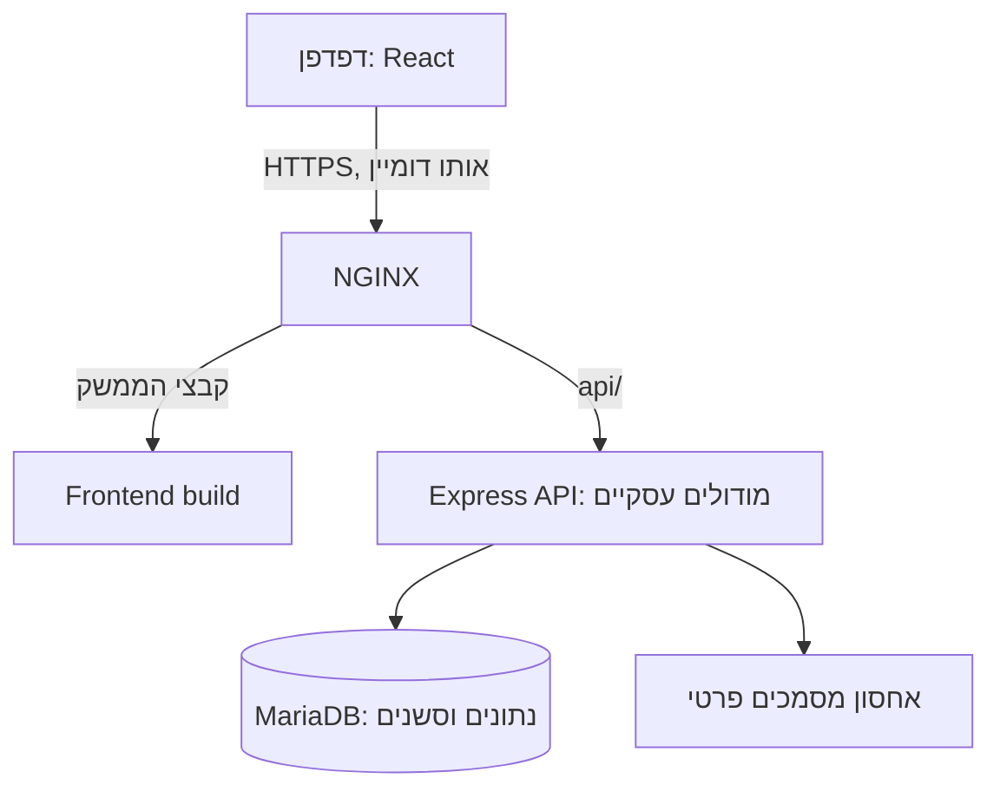

# סקירת מבנה המערכת: Frontend, Backend, NGINX, אימות ו־UI/UX

תאריך בדיקה: 14 בספטמבר 2026. מבוסס על קריאת הקוד ועל מקורות ראשוניים ורשמיים. זו סקירת תכנון, לא בדיקת חדירה או אישור מוכנות לפרודקשן. לא נבדקה תצורת שרת חיצוני. ההמלצות על בחירת המבנה וסדר הביצוע הן מסקנות לפרויקט הזה, ולא הוראה של תקן לבחור טכנולוגיה מסוימת.

## ההמלצה לפרויקט

להמשיך עם React ו־TypeScript בצד הלקוח, Express ו־TypeScript בצד השרת ו־Prisma מול MariaDB. להפעיל Backend אחד המחולק למודולים עסקיים, ולהוסיף שכבת פריסה מסודרת עם NGINX ו־HTTPS. לא נמצא צורך נוכחי שמצדיק פיצול למיקרו־שירותים או החלפת מסד הנתונים.

מסד הנתונים ואחסון המסמכים לא נגישים ישירות מהאינטרנט. הורדת מסמך עוברת בדיקת הרשאה בשרת. זהו מבנה מוצע לפריסה עצמאית; פלטפורמה מנוהלת שמספקת Reverse Proxy ו־TLS יכולה למלא את תפקיד NGINX.

## מה נמצא בקוד

| נושא | מצב שנבדק | משמעות |
|---|---|---|
| הפרדת צדדים | תיקיות `frontend` ו־`backend`, מודולים עסקיים בשרת | בסיס מתאים להמשך |
| אימות | `gate.service.ts` מייצר טוקן אקראי בן 32 בתים ושומר hash שלו בסשן ב־DB | זהו סשן עם מזהה אטום, לא JWT |
| אחסון הטוקן | `frontend/src/services/api.ts` קורא טוקן מתוך localStorage | עדיפות גבוהה לשינוי לפני חשיפה ציבורית |
| משתמשים | אימות מול משתמשים ב־DB, סיסמאות מגובבות, תפקידים וסטטוס | חלק מההערות וה־README עדיין מתארים שער משותף ישן |
| Proxy | `app.ts` מגדיר `trust proxy = 1` ללא תנאי | צריך להתאים לפריסה בפועל ולמנוע גישה שעוקפת את הפרוקסי |
| CORS | רשימה ריקה מאפשרת כל origin, ללא חסימה ייעודית בסביבת production | אין להסתמך על ברירת המחדל בפריסה ציבורית; CORS אינו מנגנון הרשאות |
| הגבלת כניסה | מגבלת ניסיונות לפי IP בזיכרון התהליך | אין ניקוי של מפת הכתובות; אין שיתוף בין מופעי שרת |
| אבטחת תגובות | כותרות אבטחה ב־Express | מדיניות CSP של API אינה מגינה על HTML שיוגש בנפרד |
| קבצים | אחסון פרטי מקומי והעלאות לזיכרון עם מגבלת גודל | דורש דיסק מתמשך, גיבוי ומגבלות משאבים בפריסה |
| בדיקות | CI לבנייה, lint, טיפוסים ובדיקות Backend עם MySQL | יש בסיס; בדיקות הדפדפן שביצענו עדיין אינן מסלול E2E קבוע ב־CI |
| ממשק | חמישה יעדים ראשיים, רכיבים משותפים, RTL וטעינה לפי מסך | לשמר את המבנה ולבדוק שימושיות ונגישות בצורה שיטתית |

## Frontend

ארגון מוצע לפי תחומים: `features/credit`, `features/forecast`, `features/transactions`; רכיבים כלליים ב־`components/common`; שכבת API ייעודית; טיפוסי בקשות ותשובות ברורים. לפצל בהדרגה מסכים גדולים לרכיבי תצוגה, טפסים ו־hooks. לא לבצע העברת קבצים גורפת בלי צורך.

React ממליצה לפרק ממשק להיררכיית רכיבים ולהחזיק מצב מינימלי עם בעלות ברורה. בפרויקט זה המשמעות היא להפריד בין נתוני שרת, טיוטת טופס, בחירת מסננים ותרחיש שכבר הוחל. חישובים כספיים מחייבים נשארים בשירותי השרת. מקור: [Thinking in React](https://react.dev/learn/thinking-in-react).

בפרודקשן להגיש build מוכן. `vite preview` מיועד לתצוגה מקומית, ולא לשרת פרודקשן. כתובת API מוצעת: `/api` באותו דומיין, במקום ברירת המחדל `localhost:3000` בדפדפן המשתמש. מקור: [Vite deployment](https://vite.dev/guide/static-deploy.html).

## Backend ונתונים

ליישר מודולים בהדרגה לזרימה: Route → ולידציה והרשאות → שירות עסקי → גישה לנתונים. אין צורך בקובץ Controller נוסף לכל פעולה קטנה. נדרשת בעיקר בעלות ברורה על כל כלל פיננסי.

לשמר מקור אמת משותף לדוחות, אשראי ותחזית; שימוש ב־Decimal ועיגול בנקודות מוגדרות; הפרדה בין מועד עסקה, ייחוס הוצאה וירידה מהבנק; טיפול בזיכויים ובמימון פנימי. פעולות שמשנות כמה רשומות דורשות טרנזקציה ואידמפוטנטיות לפי המקרה.

כל גישה לישות נבדקת לפי זהות המשתמש וההרשאה לפעולה. הסתרת כפתור או תפקיד שהגיע מהדפדפן אינם בדיקת הרשאה. להוסיף בדיקות של משתמש א׳ מול מזהי מסמכים וחשבונות של משתמש ב׳. מקור: [OWASP Authorization](https://cheatsheetseries.owasp.org/cheatsheets/Authorization_Cheat_Sheet.html).

לשיפור ביצועים: למדוד מספר שאילתות וזמן תגובה לפני שינוי. `reportsService.trend` מבצע סיכומים חודשיים בלולאה; אפשר לבחון צבירה יעילה יותר בלי לייצר נוסחת סכומים נוספת. אם ייבואים גדולים חוסמים את השרת, להוציא עיבוד כבד לעובד רקע עם מצב התקדמות. אין צורך להוסיף תור לפני מדידה.

## NGINX ופריסה

NGINX יגיש קבצי Frontend ויעביר את `/api/` ל־Express. יש להגדיר TLS, העברת כותרות בהתאם לטופולוגיה ומגבלות בקשות. מקור: [NGINX Reverse Proxy](https://docs.nginx.com/nginx/admin-guide/web-server/reverse-proxy/).

הגדרות שיש להכין ולבדוק:

- HTTP מפנה ל־HTTPS; חידוש תעודות אוטומטי ונבדק.
- נתיבי SPA חוזרים ל־`index.html`; שגיאות API אינן חוזרות כ־HTML.
- קבצים עם hash יכולים לקבל cache ממושך; HTML מתעדכן במהירות; תגובות כספיות אישיות אינן נכנסות ל־cache משותף.
- מגבלת העלאה מתואמת עם השרת, כולל overhead של multipart, ומגבלת זמן לעיבוד.
- כותרות אבטחה מותאמות לממשק עצמו, עם CSP שנבדקה מול React והגרפים.
- Express נגיש רק דרך הרשת הפרטית/המקומית המתוכננת. אין לפרסם את פורט ה־DB.

`trust proxy` חייב להתאים למספר הפרוקסים ולנתיבי הגישה האמיתיים. תיעוד Express מזהיר שאמון שגוי בכותרות או נתיבים באורכים שונים עלול לאפשר זיוף כתובת לקוח. מקור: [Express behind proxies](https://expressjs.com/en/guide/behind-proxies/).

פריסה צריכה לכלול הפעלה מחדש לאחר קריסה, בדיקת readiness, סודות מחוץ ל־Git, מיגרציות מנוהלות, גיבוי DB ומסמכים ובדיקת שחזור. לפני העברת לוגים לשירות חיצוני יש להסיר תיאורי עסקאות, סכומים ופרטים אישיים שאינם נחוצים לניטור. ההבחנה בין סביבת פיתוח לפרודקשן והצורך ב־TLS נתמכים ב־[Express production security](https://expressjs.com/en/advanced/best-practice-security/).

## JWT או Session?

ליישום הדפדפן הנוכחי ההמלצה היא לשמר סשנים בשרת ולהעביר את מזהה הסשן לעוגייה עם `HttpOnly`, `Secure` ו־`SameSite` שנבחר לפי זרימת ההתחברות. עבור אותו דומיין אפשר לבחון עוגייה עם קידומת `__Host-`, ללא Domain ועם Path=/.

OWASP ממליצה לא לשמור מזהי סשן וטוקני אימות ב־localStorage או sessionStorage, הנגישים ל־JavaScript. `HttpOnly` מגביל קריאה של העוגייה באמצעות JavaScript, אך אינו מבטל את הצורך בהגנה מפני XSS. מקור: [OWASP Session Management](https://cheatsheetseries.owasp.org/cheatsheets/Session_Management_Cheat_Sheet.html).

מעבר לעוגייה חייב להתבצע יחד עם הגנת CSRF לפעולות משנות מצב, בדיקת Origin וסקירת פעולות GET. בפרויקט קיימות סריקות שמייצרות רשומות במהלך קריאה; יש להחליט איך להפריד אותן. SameSite לבדו אינו תחליף כללי להגנת CSRF. מקור: [OWASP CSRF Prevention](https://cheatsheetseries.owasp.org/cheatsheets/Cross-Site_Request_Forgery_Prevention_Cheat_Sheet.html).

JWT מתאים כאשר יש צורך מוכח, למשל API הנצרך בידי כמה שירותים או שילוב עם ספק זהות. בחירה כזו מחייבת אימות חתימה, רשימת אלגוריתמים מותרת, issuer, audience ותוקף, וכן תכנון ביטול גישה ורענון. JWT חתום אינו בהכרח מוצפן. שינוי תפקיד/חסימת משתמש אינם מתעדכנים אוטומטית בטוקן שכבר הונפק. מקור: [IETF RFC 8725](https://www.rfc-editor.org/rfc/rfc8725.html).

בפרויקט יש גם צורך לבדוק את פרמטרי `scrypt`: הקוד משתמש בברירות המחדל ואינו שומר גרסת אלגוריתם ועלות לצד hash. יש לבחור פרמטרים מדודים או Argon2id ולתכנן שדרוג hash בהתחברות מוצלחת, עם תאימות לסיסמאות קיימות. מקור: [OWASP Password Storage](https://cheatsheetseries.owasp.org/cheatsheets/Password_Storage_Cheat_Sheet.html).

## UI/UX למערכת פיננסית

ההצעה שלי היא שהמסך הראשי יענה על שלוש שאלות: מה רשום כרגע, מה צפוי בקרוב, ומה דורש פעולה. בכל מסך תהיה פעולה מרכזית וסיכום קצר; פירוט וכלים נדירים נפתחים לפי הצורך. עקרון החשיפה ההדרגתית מפחית מורכבות, אבל ריבוי שכבות הסתרה עלול לפגוע בגילוי פעולות. מקור: [NN/g Progressive Disclosure](https://www.nngroup.com/articles/progressive-disclosure/).

זרימות מוצעות:

1. ייבוא: בחירת מקור/כרטיס → תצוגה מקדימה → זיהוי כפילויות וחוסרים → אישור → סיכום וקישור לתוצאה.
2. אשראי: בחירת כרטיס → החיוב הקרוב והתקופה הנבחרת → חיפוש ופירוט → תיקון שיוך/סיווג.
3. תחזית: הסבר קצר על מקור הנתונים → תרחיש → שינוי מול הבסיס → פעולה אפשרית.

נתון חסר צריך להיות מובחן מאפס; חישוב צריך להיות מובחן מנתון מדוח; תאריך חישוב צריך להיות מובחן ממועד ייבוא ומתקופת כיסוי. שמירת טיוטות והודעת הצלחה ברורה עדיפות על בקשת אישור לכל לחיצה.

לפעולות בעלות השלכות על נתונים, WCAG 3.3.4 מציע לפחות אחת מהחלופות: אפשרות לבטל, בדיקת קלט עם אפשרות לתקן, או סקירה ואישור לפני השלמה. בפרויקט יש להתאים זאת למחיקת ייבוא, שיוך קבוצתי וסגירת הלוואה. מקור: [W3C Error Prevention](https://www.w3.org/WAI/WCAG22/Understanding/error-prevention-legal-financial-data.html).

יעד נגישות מוצע: WCAG 2.2 AA. לבדוק מקלדת, מיקוד גלוי, ניגודיות בכל ערכות הנושא, תוויות טפסים, שגיאות ליד השדה ו־RTL. גודל היעד המינימלי ב־2.5.8 הוא 24×24 CSS pixels עם חריגים; לפעולות עיקריות במובייל מוצע יעד מוצר גדול יותר, סביב 44×44. לא לחסום הדבקת סיסמאות או מנהלי סיסמאות. מקורות: [W3C Target Size](https://www.w3.org/WAI/WCAG22/Understanding/target-size-minimum.html), [W3C Accessible Authentication](https://www.w3.org/WAI/WCAG22/Understanding/accessible-authentication-minimum.html).

יש לבדוק עם משתמשים משימות ממשיות: זיהוי חיוב, מציאת עסקה, תיקון שיוך והבנת תחזית. למדוד הצלחה, טעויות וצורך בעזרה. בדיקת דפדפן אוטומטית או היעדר גלילה אופקית אינם הוכחה לשימושיות או לעמידה מלאה בנגישות.

## מצב היישום לאחר הסקירה

יושמו Cookie מסוג HttpOnly במקום Bearer בדפדפן, CSRF, בדיקת Origin, תפוגה בחוסר פעילות, חיזוק scrypt ושדרוג גיבובים ישנים בכניסה. נוספו תבניות NGINX ו־systemd; פריסה ציבורית ושחזור גיבוי טרם בוצעו. ראו [הוראות פריסה וגבולות המימוש](production-deployment.md).

## סדר עבודה מוצע

| שלב | תוצאה נדרשת | קריטריון קבלה |
|---|---|---|
| 1. אימות והרשאות | Cookie session, CSRF, סיסמאות ומדיניות תפוגה | כניסה/יציאה, חסימת משתמש, בקשה זרה ומשתמש זר נבדקים מקצה לקצה |
| 2. פריסה | HTTPS, NGINX או חלופה מנוהלת, רשת פרטית, גיבויים | רענון SPA ו־API תקינים; פורטים פנימיים חסומים; שחזור מגיבוי נבדק |
| 3. תחזוקת קוד | פיצול מסכים גדולים וגבולות מודולים ברורים | אין שינוי בסכומים או בחוזי API בלי בדיקות מתאימות |
| 4. שימושיות | ייבוא מודרך, הודעות ברורות ונגישות | משימות משתמש נבדקות במובייל, במקלדת ובקורא מסך |
| 5. גדילה | אופטימיזציית שאילתות, עובד רקע ומגבלת קצב משותפת לפי צורך | החלטות מתקבלות לפי עומס וזמני תגובה שנמדדו |

השלב הראשון אינו מחייב להחליף את ה־Frontend, את ה־Backend או את סוג הטוקן ל־JWT. הוא מחייב להגדיר במדויק את גבולות האמון ואת חיי הסשן ולבדוק אותם.
